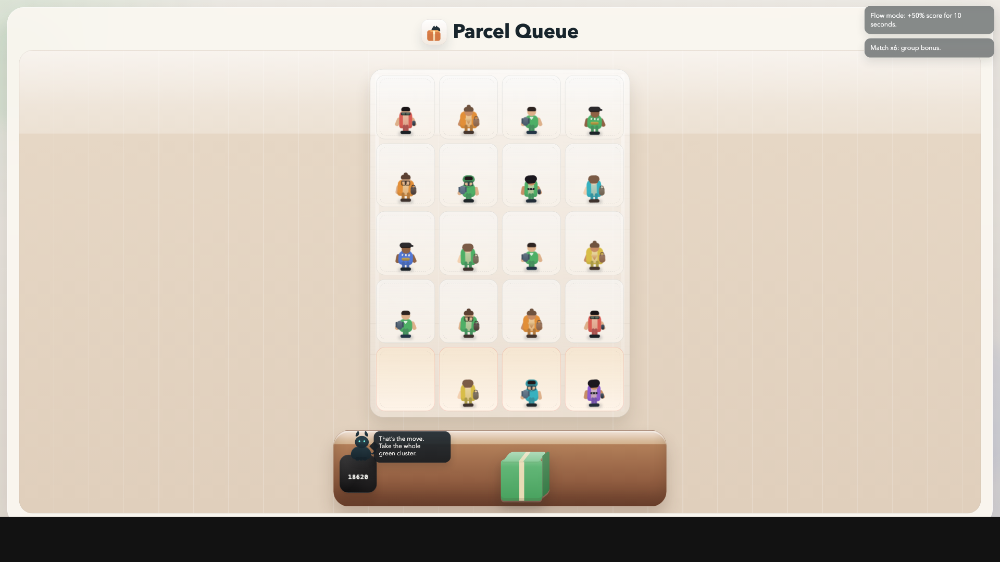
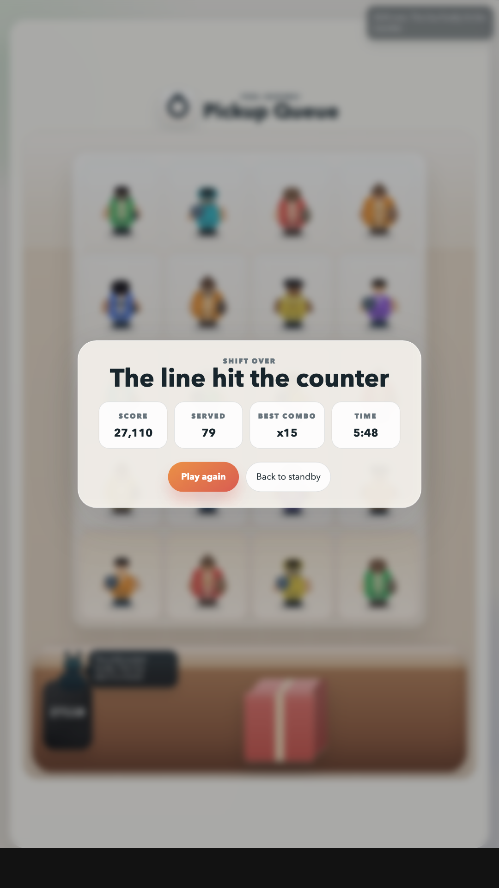
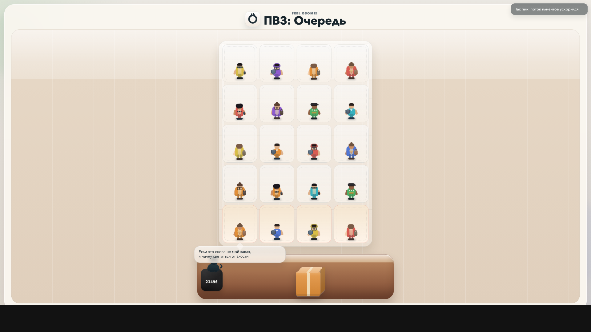
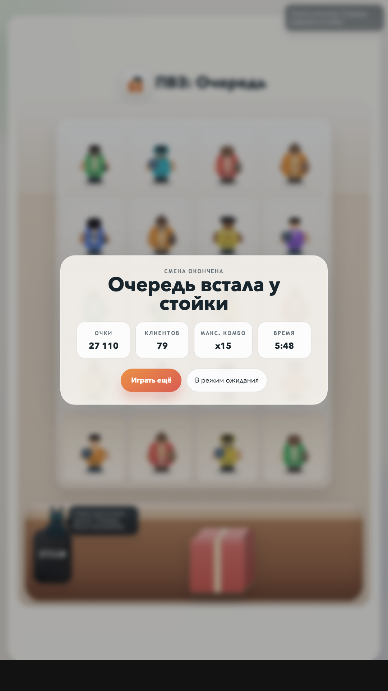
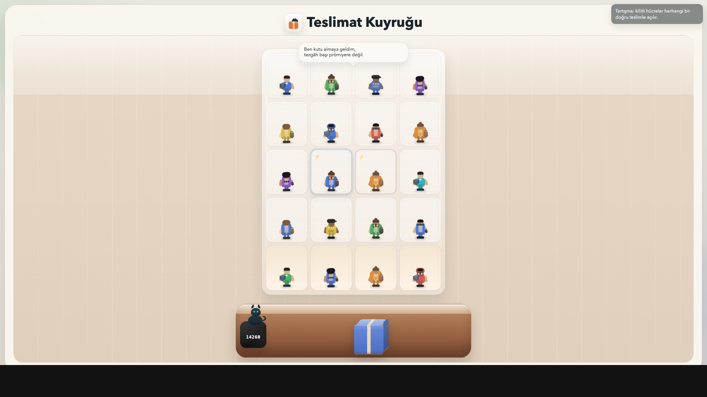
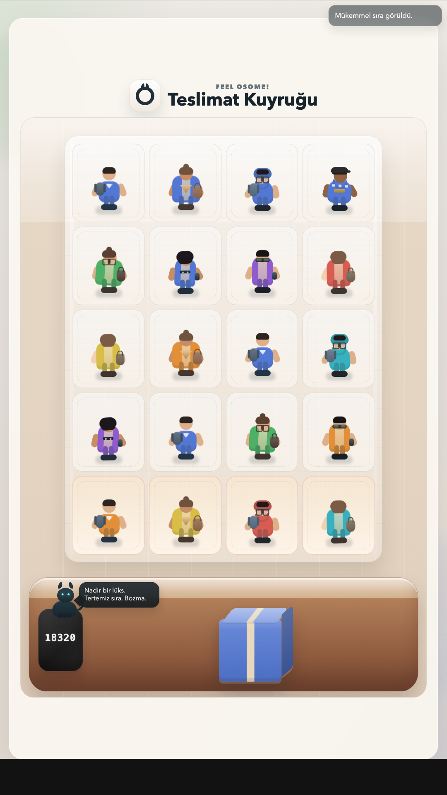

# ПВЗ: Очередь


Браузерная игра про адскую смену в пункте выдачи заказов.

Игрок видит поле `4x5` с очередью клиентов и текущую цветную коробку на стойке. Нужно тапать по клиенту того же цветового типа. Если от выбранного клиента есть ортогонально связная группа `3+` того же цвета, она исчезает целиком. Ошибка сбрасывает комбо и ускоряет рост напряжения. Правильные действия приносят очки, комбо, временные бонусы и усиливают темп игры. По мере сессии растут базовая сложность, частота гиммиков и адаптивная скорость спавна.

## Скриншоты

### English





### Русский





### Türkçe





## Автор

- Автор: [Ilya Mirin](https://www.linkedin.com/in/ilyamirin)

## License

Код проекта распространяется по лицензии `MIT`. Полный текст см. в [LICENSE](LICENSE).

Важно:

- MIT относится к оригинальному содержимому репозитория
- звуки в `assets/audio/` являются сторонними ассетами и сохраняют свои исходные лицензии

## AI Attribution

Если не указано иное, весь оригинальный контент в этом репозитории является `AI-generated` или создан с существенной `AI assistance`.

- код
- тексты и микрокопирайт
- SVG-иконки
- визуальные концепты и брендовые варианты
- игровая сцена и UI-оформление

Исключения:

- скачанные внешние ассеты не являются `AI-generated`
- для текущей версии игры это прежде всего звуки в `assets/audio/`
- для этих ассетов действуют их исходные лицензии и атрибуция из раздела [Audio Sources](#audio-sources)

## Что Уже Есть

- Поле очереди `4x5`
- 7 цветных коробок: `red`, `orange`, `yellow`, `green`, `cyan`, `blue`, `violet`
- Tap-only управление
- Один активный товар на стойке
- Ортогонально связанные группы `3+` одного цвета убираются одним тапом
- Очки, комбо, таймер, экран конца игры
- Адаптивный спавн под темп игрока
- 2 рабочих гиммика:
  - `quarrel`
  - `rush`
- Аудио через Web Audio + локальные ассеты
- Полная локализация `ru / en / tr`
- Кот-комментатор событий, бонусов и темпа смены
- Баланс с длинной сессией и нарастанием сложности по фазам
- Симулятор баланса для подбора темпа
- Инструменты для постановочных локализованных скриншотов

## Как Играть

1. Открой страницу игры.
2. Тапни по сцене, чтобы начать смену.
3. Смотри на цвет коробки на стойке.
4. Тапай по клиенту того же цвета.
5. Если попал в ортогонально связанную группу `3+` того же цвета, исчезнут все клетки, между которыми можно пройти вверх, вниз, влево или вправо.
6. Избегай ошибок: они сбрасывают комбо и ускоряют рост напряжения.
7. Держи очередь под контролем. Игра заканчивается, когда новая ячейка спавна сверху больше недоступна.

## Геймплей В Текущей Версии

### Базовый цикл

- Клиенты спавнятся сверху по колонкам и падают вниз в свободные места.
- На стойке всегда показана одна текущая цветная коробка.
- Игрок кликает или тапаeт по клиенту.
- Если цвет клиента совпадает с коробкой на стойке, клиент уходит.
- Если у клиента есть ортогонально связная группа того же цветового типа, группа `3+` уходит целиком.
- Если не совпадает, клиент злится, комбо сбрасывается, давление растет.
- После обслуживания колонка схлопывается вниз.
- Базовый спавн постепенно ускоряется, но дополнительно подстраивается под реальную скорость игрока.

### Очки И Бонусы

- Базовая выдача: `+10`
- Комбо: `+5` за каждый следующий шаг в серии
- Связка `3+`: дополнительные очки за размер всей ортогонально связной группы
- Быстрая реакция: `+3`, если клиент обслужен быстро после входа в зону доступа
- Идеальный ряд: `+20`
- Режим потока после серии без ошибок
- Быстрый старт расширяет зону доступа
- Антистресс срабатывает после серии ошибок

### Гиммики

- `quarrel`: часть ячеек блокируется, конфликт можно погасить выдачей
- `rush`: временно ускоряет спавн

## Баланс И Сложность

Баланс хранится в [balance-config.js](balance-config.js).

Ключевые свойства текущего конфига:

- рост сложности идёт длинной фазовой кривой примерно до `11` минут
- в первые секунды старт уже агрессивный, но поток затем дополнительно подстраивается под темп игрока
- `quarrel` открывается раньше `rush`
- быстрые игроки получают более плотный поток клиентов
- медленные игроки получают чуть более мягкий темп, но общая сложность всё равно растёт

Важно про симуляцию:

- `casual`, `solid`, `expert` существуют только в `scripts/simulate-balance.cjs`
- это не режимы реальной игры, а модель трёх разных ботов для оценки баланса
- в рантайме игра использует единую адаптивную систему спавна

Текущая кривая на симуляции после последнего ребаланса с более агрессивным стартом:

- `casual`: avg `9:16`, p90 `10:56`
- `solid`: avg `9:01`, p90 `10:45`
- `expert`: avg `9:37`, p90 `11:08`

## Структура Проекта

```text
index.html              Статическая разметка сцены и UI
styles.css              Весь визуальный слой и адаптивность
game.js                 Игровая логика, рендер, аудио, ввод
balance-config.js       Конфиг фаз сложности, давления и adaptive spawn
locales.js              Локализация UI, клиента и кота на ru/en/tr
assets/audio/           Звуки интерфейса и игры
assets/icons/           SVG-иконки типов товаров
assets/brand/           Текущий логомарк и брендовые черновики
marketing/screens-clean/ Локализованные still-скриншоты
tools/stills.html       Viewer для постановочных скриншотов
tools/stills-data.js    Драматические still-сцены
scripts/capture-stills.cjs
scripts/build-yandex.cjs
scripts/check-secrets.mjs
scripts/pre-commit.mjs
scripts/simulate-balance.cjs
.githooks/pre-commit
```

## Быстрый Старт

### Требования

- `Node.js`
- `npm`
- любой простой статический сервер

### Установка

```bash
npm install
npm run hooks:install
```

### Локальный запуск

Самый простой вариант:

```bash
python3 -m http.server 8124
```

Потом открой:

```text
http://127.0.0.1:8124/
```

Если на машине `127.0.0.1` не подхватывается из-за конкретной конфигурации сервера, попробуй:

```text
http://localhost:8124/
```

## GitHub Pages

Проект подходит для `GitHub Pages` без сборки:

- сайт статический;
- точка входа лежит в корне репозитория: `index.html`;
- все игровые ассеты подключаются относительными путями;
- в репозитории есть `.nojekyll`, чтобы Pages не пытался обрабатывать сайт как Jekyll-проект.

Базовый способ публикации:

1. Запушить репозиторий в GitHub.
2. Открыть `Settings -> Pages`.
3. В `Build and deployment` выбрать:
   - `Source`: `Deploy from a branch`
   - `Branch`: `main`
   - `Folder`: `/ (root)`
4. Дождаться публикации.

После этого игра будет доступна по адресу вида:

```text
https://<username>.github.io/<repo-name>/
```

## Команды

```bash
npm run format
npm run format:check
npm run lint
npm run secrets:check
npm run hooks:install
npm run balance:simulate
npm run balance:search
npm run build:yandex
npm run stills:capture
```

### Полезные примеры

Проверить текущий баланс:

```bash
npm run balance:simulate -- --runs 180
```

Прогнать сглаживание или варианты:

```bash
npm run balance:simulate -- --runs 180 --smoothStepMs 15000
npm run balance:simulate -- --runs 180 --spawnScale 1.04 --lateSpawnScale 1.06 --tensionScale 0.97 --lateTensionScale 0.98 --orderShift 0.08
```

Поиск кандидатов для балансировки:

```bash
npm run balance:search -- --runs 180
```

Переснять все локализованные скриншоты:

```bash
npm run stills:capture
```

Снять одну конкретную сцену:

```bash
node ./scripts/capture-stills.cjs --scene cluster_burst --locale en --orientation landscape
```

## Качество Кода

В проекте есть:

- `Prettier` для форматирования
- `ESLint` для статического анализа
- локальный secret scan по staged-файлам
- pre-commit hook через `.githooks/pre-commit`

Перед коммитом стоит минимум прогонять:

```bash
npm run format:check
npm run lint
```

Если менялась игровая логика, дополнительно:

```bash
npm run balance:simulate -- --runs 180
```

## Audio Sources

Используемые в игре звуки:

- `assets/audio/confirmation_002.ogg`
- `assets/audio/error_005.ogg`
- `assets/audio/open_001.ogg`
- `assets/audio/question_002.ogg`
- `assets/audio/bonus_levelup.mp3`
- `assets/audio/fail_gameover.wav`
- `assets/audio/fail_gameover.mp3`

### Kenney Interface Sounds

Файлы:

- `confirmation_002.ogg`
- `error_005.ogg`
- `open_001.ogg`
- `question_002.ogg`

Источник:

- локальный архив: `assets/audio/src/kenney_interfaceSounds.zip`
- оригинальный пак: [Kenney Interface Sounds](https://kenney.nl/assets/interface-sounds)

Лицензия:

- `CC0 1.0`
- локальное подтверждение лежит внутри архива в `License.txt`

### MouseBYTE - Chimey UI Sounds

Файл:

- `bonus_levelup.mp3`

Источник:

- локальный архив: `assets/audio/src/mousebyte_chimeyui.7z`
- оригинальная страница: [Chimey UI Sounds](https://opengameart.org/content/chimey-ui-sounds)

Лицензия:

- `CC0`

Примечание:

- `bonus_levelup.mp3` соответствует звуку `Chime_LevelUp.mp3` из пака MouseBYTE

### zuvizu - Game Over!

Файлы:

- `fail_gameover.wav`
- `fail_gameover.mp3`

Источник:

- исходный локальный файл: `assets/audio/src/GAMEOVER.wav`
- оригинальная страница: [Game Over!](https://opengameart.org/content/game-over-0)

Лицензия:

- `CC0`

Примечание:

- `fail_gameover.wav` идентичен `assets/audio/src/GAMEOVER.wav`
- `fail_gameover.mp3` является производной конверсией того же исходника

## Архитектурные Решения

- Проект специально сделан без фреймворка и без сборки.
- Вся игра живет в одном статическом клиенте: `index.html + styles.css + game.js`.
- Баланс отделен от рантайма в `balance-config.js`, чтобы можно было тюнить сложность без переписывания основной логики.
- Симулятор баланса запускается отдельно в Node и не зависит от браузера.

## Если Дорабатывать Дальше

Хорошие следующие шаги:

- встроить более богатый интерьер без перегруза
- добавить еще типажи клиентов
- развести визуальные состояния VIP / angry / rare cases
- развести adaptive spawn на более сложные сигналы качества игры
- прикрутить сохранение рекордов в `localStorage`

## Статус Репозитория

В `assets/brand` могут лежать неиспользуемые брендовые черновики. Текущий знак в интерфейсе — рожковая `O`.
